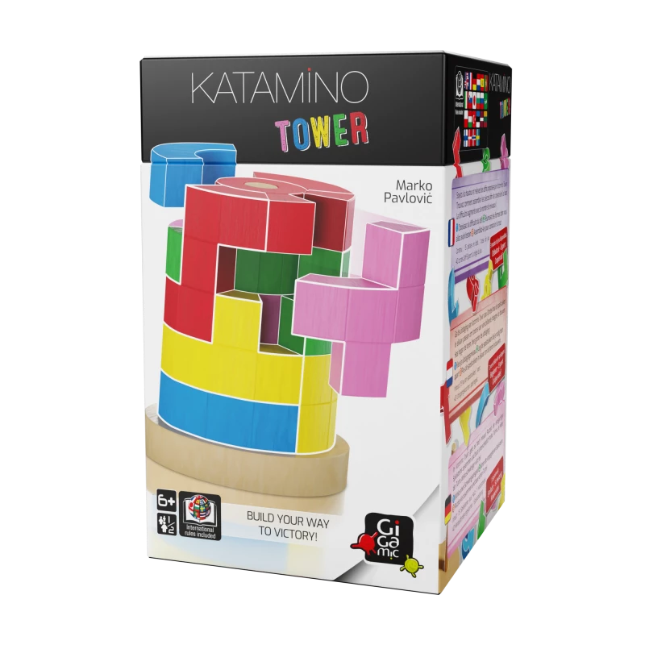

# Katamino Tower



> 3D Puzzle Solver<br>
> [Katamino Tower](https://en.gigamic.com/family-games/1109-katamino-tower.html)

English | [简体中文](./README.zh-CN.md)

## Usage

### Interactive 3D

```bash
open katamino_tower_solver.html
```
- **Drag** pieces to move, **R** to flip pentominoes, **Solve** for 3D visualization

- https://niyongsheng.github.io/katamino-tower/katamino_tower_solver.html

### C CLI

```bash
# Build (single-thread)
gcc -o katamino_tower_solver katamino_tower_solver.c

# Build (OpenMP multi-thread, macOS)
brew install libomp
gcc -I$(brew --prefix libomp)/include -Xclang -fopenmp \
    -lomp -L$(brew --prefix libomp)/lib \
    -o katamino_tower_solver katamino_tower_solver.c

# Random solve (default, finds a solution within 2000 attempts)
./katamino_tower_solver

# Exhaustive mode: enumerate all ring configurations, count total solutions
# Ring0 rotation fixed=0, total 120×12^4 ≈ 2.5M configurations
./katamino_tower_solver -a

# Exhaustive mode, stop after finding N solutions
./katamino_tower_solver -a -n 10
```

## Rules

Assemble 15 pieces around the central pillar into a complete 5-layer cylinder. Each layer fills 12 columns (30°/column).

ps: The "6+" on the box — seriously? ❓

## Algorithm

MRV (Minimum Remaining Values) backtracking search, two-phase solving:

1. **Ring Placement** — 5 rings randomly assigned to 5 layers and rotated, determining the columns blocked by ring outer arcs
2. **MRV Backtracking** — Precompute all valid pentomino placements, always try the cell with fewest candidates, randomized search order

The outer loop tries up to 2000 random ring configurations, typically finds a solution within 10~200 tries.

## Contact

+ [Email](mailto:yongshengni@gmail.com)
+ [WhatsApp](https://wa.me/8618853936112)
